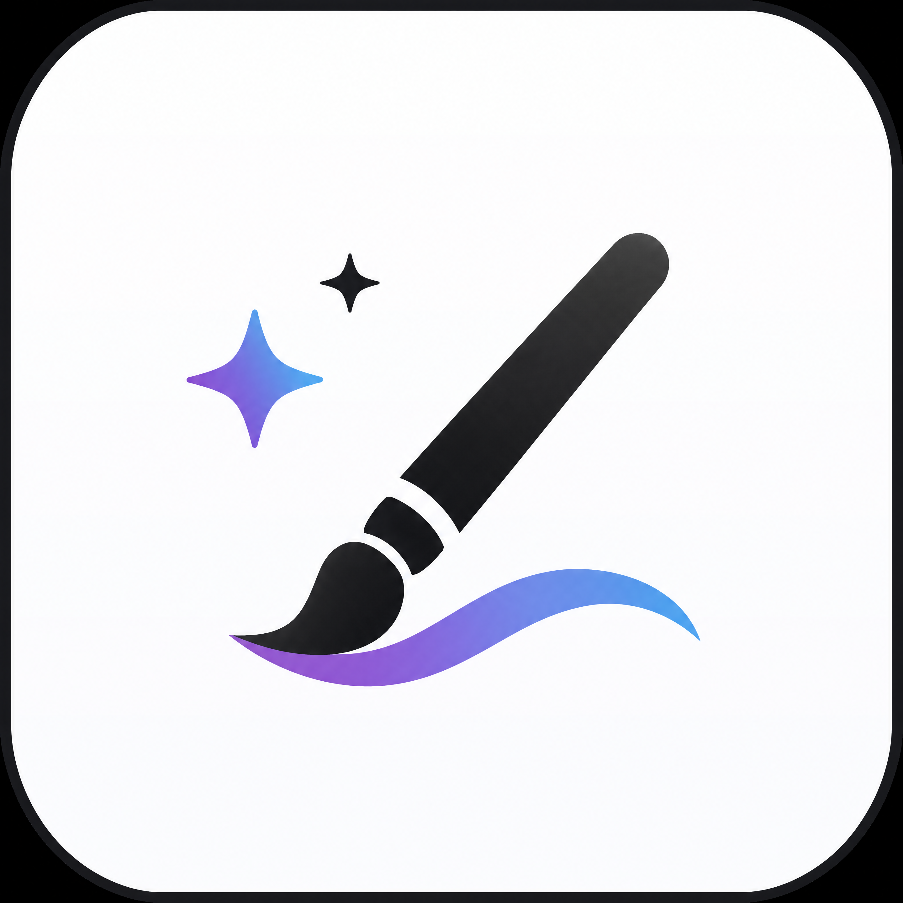

  

# Image Studio

> 开源图像生成 / 编辑客户端 · Wails(Go + React/TS) 桌面端 + Android WebView 壳层 ·
> 支持 Responses API SSE / WebSocket mode 与标准 Images API

Image Studio 面向 OpenAI 兼容图像上游，重点解决长时间图像推理在 Cloudflare / Nginx 后面容易遇到的 524/504 断连问题。Responses API 模式支持 `HTTP SSE` 与 `WebSocket mode` 两种传输；Images API 模式则兼容标准 `/v1/images/generations` 与 `/v1/images/edits`。

项目不内置任何默认上游。首次启动需要你自己填写 BASE_URL、API Key、文本模型与图像模型。

当前没有独立部署的在线 Web 版。仓库里的浏览器预览主要用于前端调试和 target platform 预览，不等同于可直接对外提供服务的 SaaS Web 端。

**配套项目 [Image-Prompts](https://prompts.sorry.ink/) 提供提示词浏览与一键导入能力，支持把网页上的提示词直接送入 Image Studio 桌面端。相关说明见 [docs/prompt-import.md](./docs/prompt-import.md)。**

## 快速上手

1. 安装应用
   - 稳定版本:到 [RoseKhlifa/Image-Studio Releases](https://github.com/RoseKhlifa/Image-Studio/releases) 下载。
   - 抢先体验当前分支的最新改动:到 [DR-lin-eng/Image-Studio Actions · release.yml](https://github.com/DR-lin-eng/Image-Studio/actions/workflows/release.yml) 下载最近一次成功构建的 artifact。
     Windows 上这类 CI `exe` 如果没有签名，可能会被 Win11 Smart App Control / SmartScreen 拦截，因此只建议用于内部测试。
   - 各平台安装包区别、命名规则和选择建议见 [docs/packages.md](./docs/packages.md)。
2. 首次启动后打开「上游配置」，填写 API 形态、BASE_URL、API Key、文本模型 ID、图像模型 ID。
3. 根据上游能力选择 API 形态
   - Responses API:更适合长推理、抗 524/504。
   - Images API:更适合只提供标准图像接口的兼容上游。
4. 输入 prompt，设置比例、质量、输出格式和风格；如果内置比例不够，可以打开「自定义比例」弹窗保存常用宽高比。
5. 点击「生成」，或使用 `Cmd/Ctrl + Enter`。

更完整的配置与参数策略说明见 [docs/usage.md](./docs/usage.md)。

## 遇到问题先排查

很多“生成失败 / 保存失败 / 模型不可用”并不是 Image Studio 自身的缺陷，而是上游配置、Key 权限、网关超时、模型能力或兼容实现差异导致的。

提 Issue 前建议先做这几步:

1. 在当前 profile 里点一次「测试连接」，确认 `BASE_URL`、`API Key`、文本模型 ID、图像模型 ID 真实可用。
2. 对照 [docs/troubleshooting.md](./docs/troubleshooting.md) 自查 `524/504`、`401/403`、`model not found`、多参考图/蒙版不生效、Android 保存目录行为等常见非软件问题。
3. 从历史详情或 raw 响应里确认真实 HTTP 状态码和上游报错，不要只看页面 toast。
4. 如果同样的 `BASE_URL + Key + 模型 ID` 在 curl、Postman 或上游自带调试页里也失败，优先联系你的上游服务商，而不是提交本仓库 Issue。
5. 仍然怀疑是软件问题时，再按 [docs/feedback.md](./docs/feedback.md) 准备最少复现信息提交 Issue。

## 文档导航

| 内容 | 文档 |
|---|---|
| 应用展示、界面截图、能力概览 | [docs/showcase.md](./docs/showcase.md) |
| 安装包下载、平台差异、产物选择 | [docs/packages.md](./docs/packages.md) |
| 功能清单、平台能力、快捷键 | [docs/features.md](./docs/features.md) |
| 图生图批处理的入口、流程、输入输出规则 | [docs/batch-img2img/README.md](./docs/batch-img2img/README.md) |
| 当前 issue 处理进展与待验证项 | [docs/issue-progress.md](./docs/issue-progress.md) |
| 可直接复用的 issue 关单评论模板 | [docs/issue-close-comments.md](./docs/issue-close-comments.md) |
| 源码构建、验证脚本、CI 产物链路 | [docs/build.md](./docs/build.md) |
| 真机 / 真实上游手工验证矩阵 | [docs/manual-verification.md](./docs/manual-verification.md) |
| 首次配置、API 形态选择、参数策略 | [docs/usage.md](./docs/usage.md) |
| 配套项目 Image-Prompts 与提示词导入 | [docs/prompt-import.md](./docs/prompt-import.md) |
| 提 Issue 前自查、数据存储位置、524/504、模型权限、字段兼容问题 | [docs/troubleshooting.md](./docs/troubleshooting.md) |
| 仓库结构、前端分层、内核 / Worker / Android 关系 | [docs/project-structure.md](./docs/project-structure.md) |
| 原始提示词传递策略 | [docs/no-prompt-revision/README.md](./docs/no-prompt-revision/README.md) |
| Android 壳层维护说明 | [android-shell/README.md](./android-shell/README.md) |
| Gio 高性能测试客户端 | [docs/gio-client.md](./docs/gio-client.md) |
| 跨平台内核计划与验证背景 | [docs/cross-platform-kernel-plan.md](./docs/cross-platform-kernel-plan.md) |
| 反馈渠道、问题提交、QQ群讨论 | [docs/feedback.md](./docs/feedback.md) |

## License

[GNU AGPL v3.0](./LICENSE) © 2026

这意味着基于本项目进行修改后再分发，或将修改版作为网络服务提供给他人使用时，都需要按同一许可证公开对应源码。

## 致谢

-  [**linux.do**](https://linux.do/) —— 感谢 L 站及其社区为项目开发与交流提供的支持与启发。

### 赞助商

  
    
  
    
  

