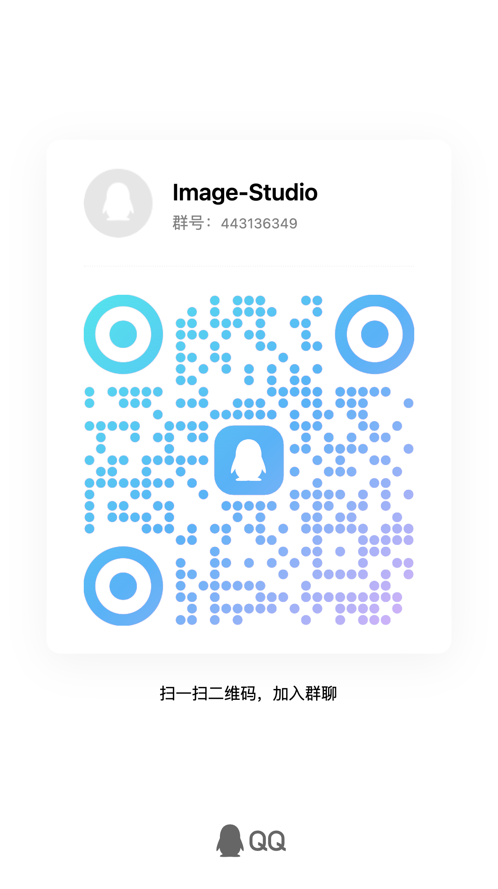

# 反馈渠道

如果你在使用 Image Studio 时遇到问题，或希望讨论新功能、使用方式与兼容性，可以通过下面的渠道反馈。

提 Issue 前请先看：

- [docs/troubleshooting.md](./troubleshooting.md)
- [docs/issue-progress.md](./issue-progress.md)
- [docs/issue-close-comments.md](./issue-close-comments.md)

很多看起来像“软件故障”的问题，实际来自:

- `BASE_URL` 填写错误或上游接口实现不完整
- `API Key` 权限、余额、白名单或模型开通状态
- Cloudflare / Nginx / relay 导致的 `524/504/5xx`
- Android 系统相册 / `MediaStore` 与桌面文件目录行为差异

如果这些因素还没有排除，先不要提交 Bug Issue。

另外：

- `issue-progress.md` 会记录当前仓库里哪些 GitHub issue 已经有代码覆盖、哪些还只缺实机验证。
- `issue-close-comments.md` 会整理那些“当前代码已覆盖，但 GitHub 还没关”的 issue 关单评论模板。
- `scripts/issue-close-helper.mjs export ...` 可以把这些评论、manifest 和处理计划一起导出成文件包，便于一次性处理。
- `scripts/issue-close-helper.mjs plan` 可以先做 dry-run，确认哪些 issue 会被评论或关闭。

提交前先看一眼，可以避免重复反馈已经落地但 issue 还没关闭的条目。

## GitHub Issues

适合提交:

- 已经完成自查后，仍可稳定复现的软件问题
- 明确的功能建议或交互改进建议
- 构建失败、平台兼容性回归、文档修正

不适合提交:

- 上游服务商自身故障、限流、封禁、白名单或余额问题
- 模型未开通、接口不兼容、relay 静默忽略字段
- 只有截图没有 raw 响应、无法描述复现步骤的模糊报错

- Issues 地址: [https://github.com/RoseKhlifa/Image-Studio/issues](https://github.com/RoseKhlifa/Image-Studio/issues)
- 建议附上系统平台、应用版本、API 形态、上游 BASE_URL 类型、错误日志或截图。
- 如果是生成失败，请尽量说明使用的是 Responses API 还是 Images API，以及对应模型 ID。

## QQ 群讨论

适合日常交流、使用经验分享、临时问题排查和测试版本反馈。

- QQ 群号: `443136349`
- 群名称: Image-Studio

  
   
  扫码加入 QQ 群讨论

